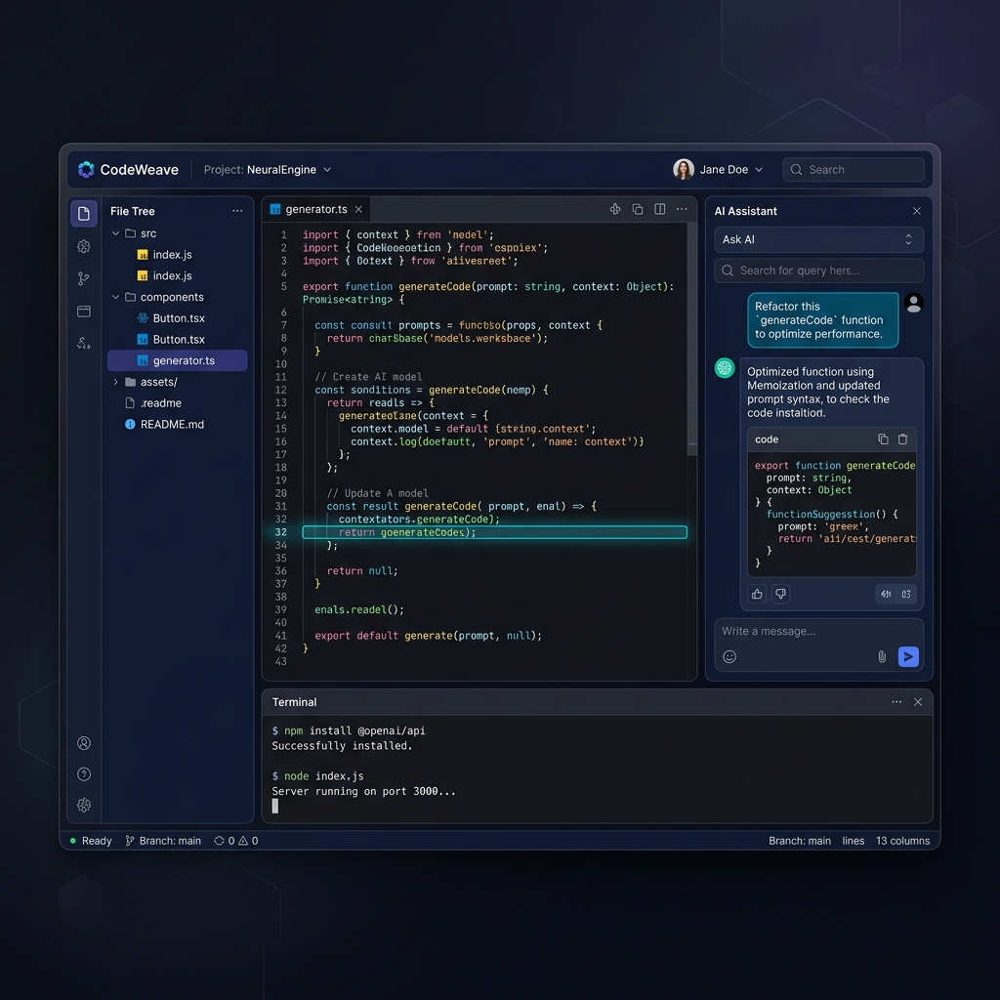
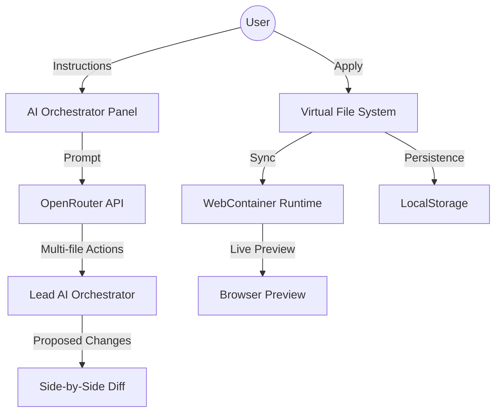

# 🌌 Polaris AI Orchestrator

[](https://nextjs.org/)
[](https://webcontainers.io/)
[](https://tailwindcss.com/)
[](https://opensource.org/licenses/MIT)

**Polaris** is a next-generation, AI-native IDE that runs entirely in your browser. It combines the power of **WebContainers** with advanced **AI Orchestration** to provide a seamless, multi-file development experience without ever leaving the tab.



## ✨ Core Features

| Feature | Description |
| :--- | :--- |
| **🤖 AI Orchestration** | Describe complex changes across multiple files and let the AI handle the heavy lifting. |
| **🚀 In-Browser Runtime** | Execute Node.js, run servers, and preview your apps instantly using WebContainers. |
| **🔍 Side-by-Side Diffs** | Review every AI suggestion with a pixel-perfect diff editor before applying changes. |
| **📁 Virtual File System** | A robust, persistent workspace that stays in sync with your browser's local storage. |
| **💻 Integrated Terminal** | A full-featured xterm.js terminal to interact with your containerized environment. |

## 🛠️ Technical Stack

- **Framework**: [Next.js 16](https://nextjs.org/) (App Router, React 19)
- **Runtime**: [WebContainer API](https://webcontainers.io/) for in-browser Node.js execution.
- **Editor**: [CodeMirror 6](https://codemirror.net/) with custom themes and syntax highlighting.
- **AI Engine**: [OpenRouter SDK](https://openrouter.ai/) for state-of-the-art model orchestration.
- **Styling**: [Tailwind CSS 4](https://tailwindcss.com/) for a sleek, modern UI.
- **UI Components**: [Lucide React](https://lucide.dev/) & [React Resizable Panels](https://github.com/bvaughn/react-resizable-panels).

## 🏗️ Architecture



## 🚀 Getting Started

### Prerequisites

- Node.js 18+ 
- An OpenRouter API Key (set in `.env`)

### Installation

1. Clone the repository:
   ```bash
   git clone https://github.com/your-username/ai-code-orchestrator.git
   cd ai-code-orchestrator
   ```

2. Install dependencies:
   ```bash
   pnpm install
   ```

3. Set up environment variables:
   ```bash
   cp .env.example .env
   # Add your OPENROUTER_API_KEY to .env
   ```

4. Run the development server:
   ```bash
   pnpm dev
   ```

5. Open [http://localhost:3000](http://localhost:3000) and start building!

## 📜 License

Distributed under the MIT License. See `LICENSE` for more information.

---

<p align="center">
  Built with ❤️ by the Polaris Team
</p>
